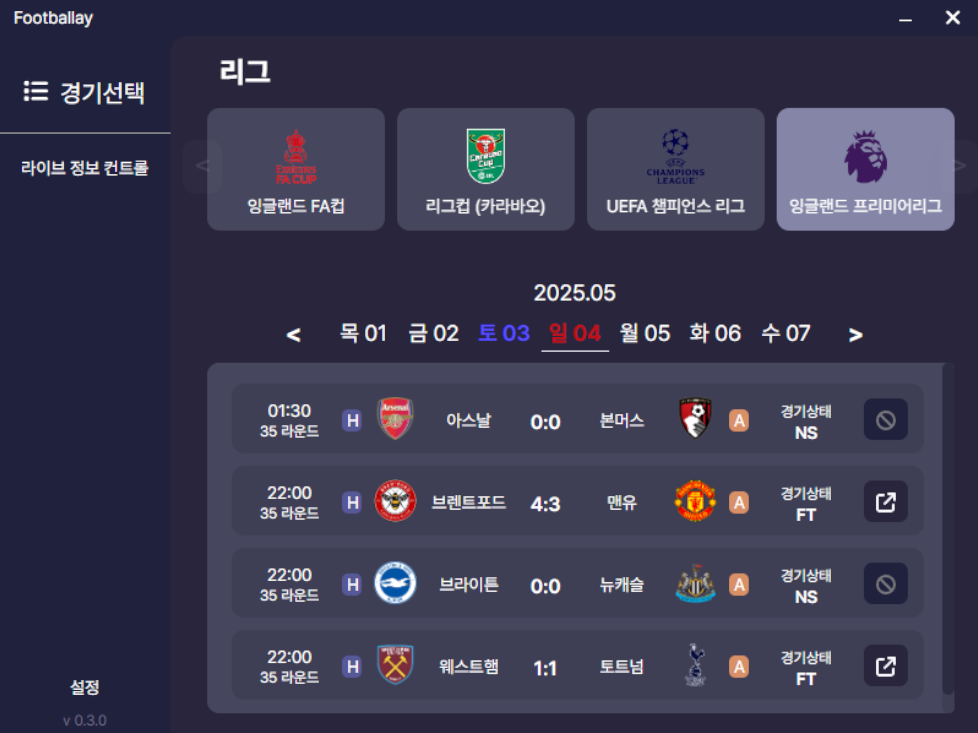
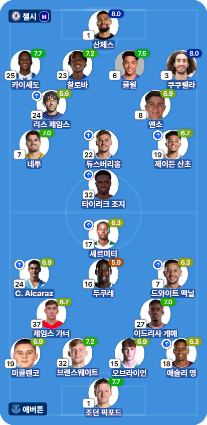
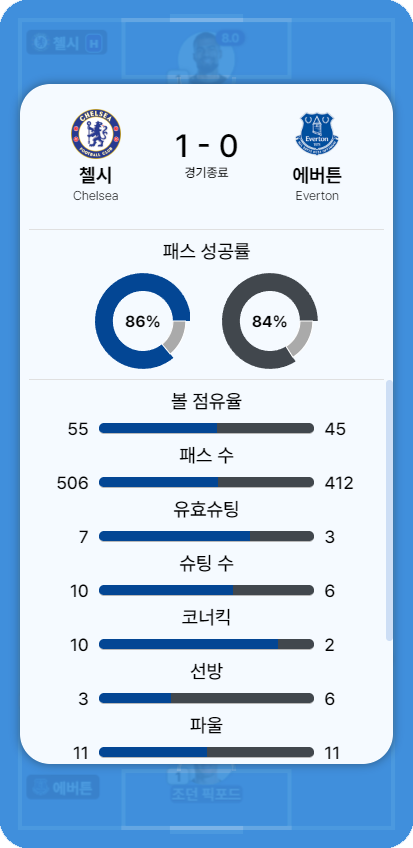
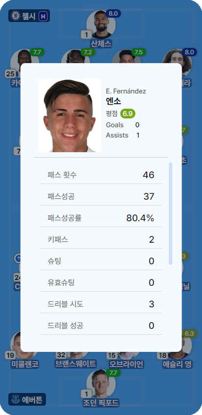

# Footballay domain Main Page 제작

이 repository 는 Footballay domain Main Page 제작을 목적으로 합니다. [Footballay Web 이동](https://footballay.com)

# Footballay App - 축구 스텟 앱

축구 경기의 라인업, 이벤트, 스텟 등을 보여주는 앱입니다.  
최 우선적으로 Football Watch-Along (축구 입중계) 스트리머에게 적절한 OBS overlay 를 제공하기 위하여 Windows 용으로 빌드된 데스크탑 앱을 기본으로 합니다. Backend Server 에서는 Live Match Data 및 리그,팀,선수 정보등을 저장하고 RESTapi 로 데이터를 제공합니다. 따라서 아래와 같은 구조로 동작합니다.

```
Client Desktop App (windows)  <->  Backend Server  <->  Data Provider API
```

Footballay + Overlay 라는 뜻에서 풋볼레이(Footballay) 라고 이름을 지었으며 footballay.com 도메인을 보유중이고 서비스 또한 해당 도메인을 사용합니다. 정적 파일은 static.footballay.com 로 접근하며 cloudflare (+R2) 를 이용해 정적파일을 제공합니다. Backend Server 는 AWS EC2 에서 구동되며 Java Spring 으로 제작되어 있습니다. 앱의 규모는 매우 작은 소규모 사이드 프로젝트이므로 비용 절약을 핵심으로 둡니다.

# Target Client & Usage

## Client - Football watch-along streamer in Korea

한국인 축구 같이보기(=입중계=watch-along) 스트리머들의 사용이 Primary Target 이며, 스트리머가 아닌 일반 사용자들도 사용하기 적합하도록 만들고 있습니다.

## Usage - OBS Match info Overlay

Primary Target 에 따라서, 스트리머들은 Matchlive Window 를 OBS window capture 기능을 이용해 Streaming Overlay 로 사용할 수 있습니다.

## Adventages of The app

### 1. 무료 & 광고 없음

무료입니다. 광고도 없습니다.

### 2. Streaming 에 최적화된 UI

OBS overlay 를 우선으로 UI 를 개발합니다. Fotmob 과 같은 축구 경기 스텟 서비스는 웹상에서 데이터 열람을 목적으로 하는 반면, **풋볼레이** 는 Overlay 를 우선 목적으로 합니다. 따라서 스트리밍에 적합한 형태로 디자인과 UI 를 구성합니다.

### 3. Streamer 편의성

Watch-along Streamer 사용을 최우선으로 고려하기 때문에 Streamer 의 피드백을 적극적으로 수용하려 합니다. 앱 개발 방향이나 기능 개선 및 버그 추적과 문제 대응에서 긴밀하게 협력함을 우선으로 합니다.

---

# screenshots of Footballay APP


리그와 원하는 경기를 선택합니다.


경기 선택 후 라인업을 볼 수 있습니다.


`tab` 키를 눌러 해당 경기에서 팀 통계를 확인할 수 있습니다.

> 팀 통계는 라이브와 10~15분 차이가 있습니다.


`'선수 프로필 사진'` 을 눌러 선수별 통계를 확인할 수 있습니다.

---

# Available League/Fixture 개념

Data Provider API 의 Coverage 와 Request Limit 으로 인해 지원하는 League/Fixture 가 제한됩니다. 예를 들어 비인기 리그의 경우 API 측에서 지원하지 않을 수도 있고, API Reqeust Limit 또는 해당 리그에 대한 지원 가능성 검토가 끝나지 않아서 Un-Available 일 수도 있습니다. 이는 앱 관리자(개발자)에 의해서 설정되는 항목이며, 이용자가 원한다면 지원 가능한 경우에 해당 리그를 지원하도록 수정할 수 있습니다. 이를 Available 또는 Availablity 라고 합니다.

Availablity 는 Fixture 에도 적용됩니다. 예를 들어 하루에 1만건의 Request Limit 이 있는 Data Provider 의 Plan 이 있고 1경기당 약 400~600 번의 Polling Request 가 발생한다면, 대략 20경기 정도 라이브 데이터 제공이 가능합니다. 그런데 FACup 같은 경우 하부리그 팀들의 qulifier 경기들이 펼쳐진다면 수십경기가 동시에 이뤄지기도 합니다. 따라서 Available League 라고 모든 경기를 지원할 수는 없습니다.

따라서 주요 팀의 주요 경기에 대해 수동으로 Availablity 를 설정해주고 있으며, Available Fixture 만 Lineup & Live data 를 받을 수 있습니다. Availablity 는 관리자(개발자)가 수동으로 지정해주고 있기 때문에, 주요 팀 경기를 제외한 경기를 원한다면 문의가 필요합니다.

현재는 EPL 전 경기를 기본으로 지원하고 있으며, EPL 팀의 관련 컵 토너먼트는 따로 문의가 있는 경우 지원하고 있습니다.

---

# 베타 버전 릴리즈 수준 서비스

개발 초기 수준 앱이므로 항상 정상동작하지 않을수도 있다는 점을 염두해야합니다.
